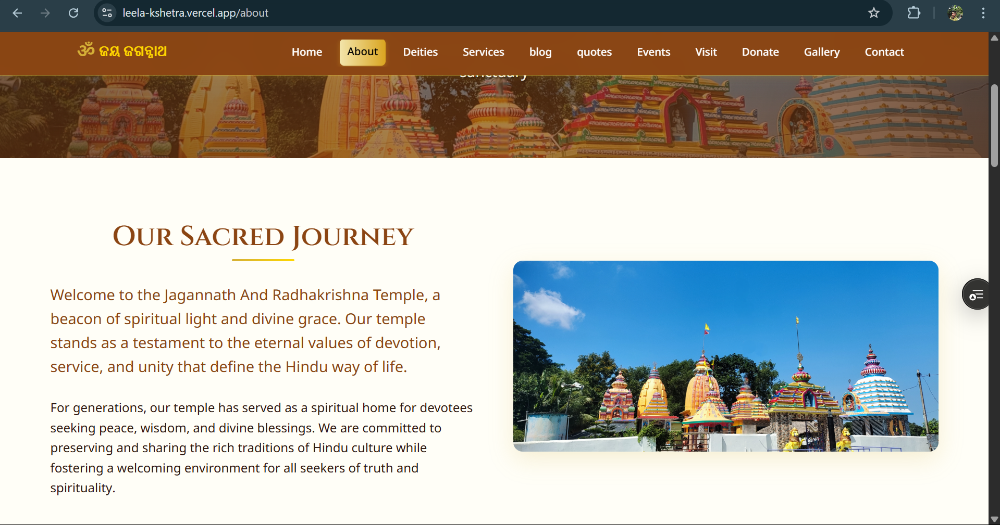
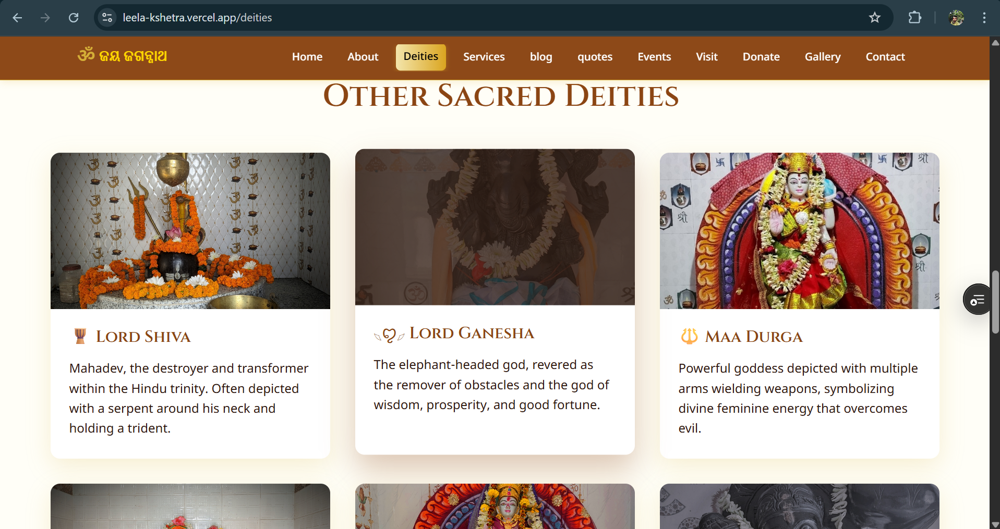
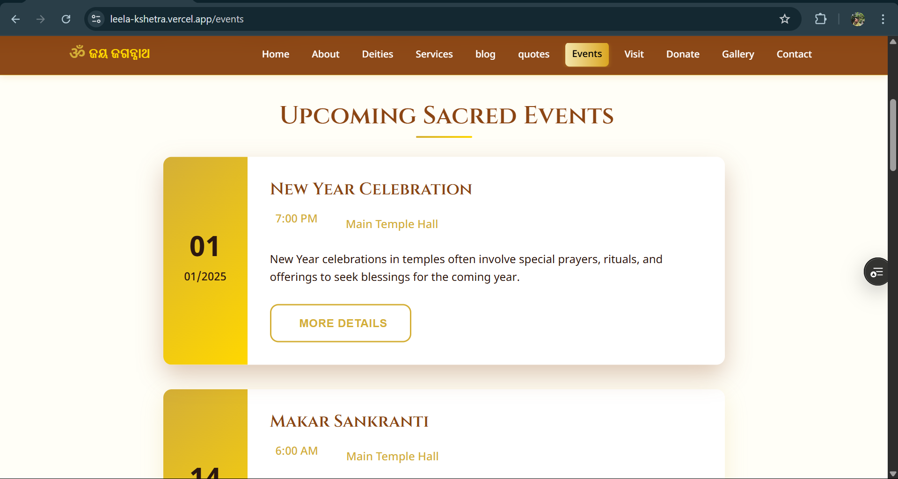
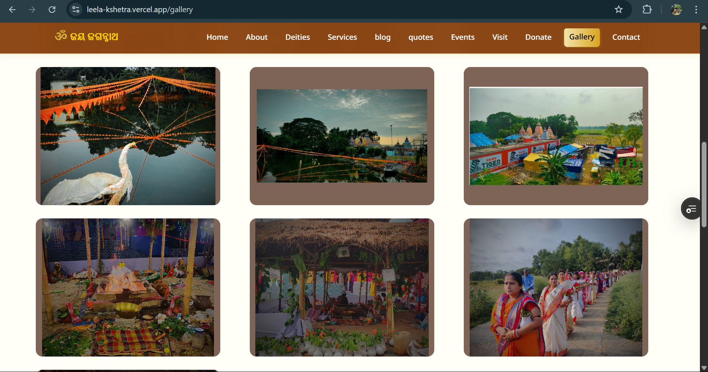
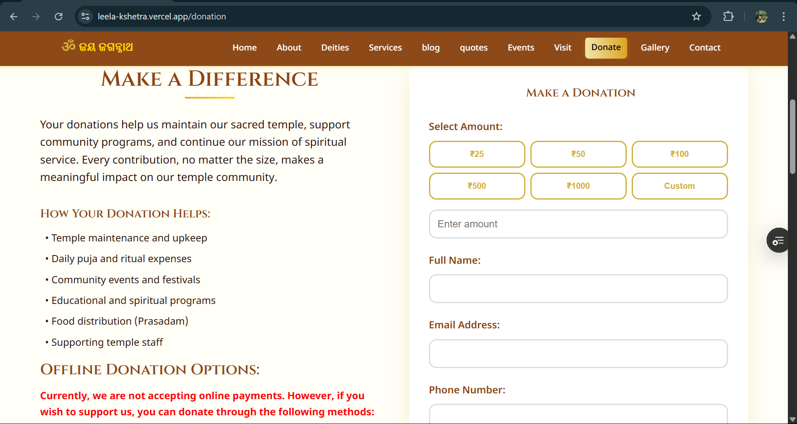

<!--
╔════════════════════════════════════════════════════════╗
║       Jagannath & Radhakrishna Temple Website         ║
╚════════════════════════════════════════════════════════╝
-->

<p align="center">
  
  <h1 align="center">Jagannath & Radhakrishna Temple</h1>
  <p align="center"><strong>A Devotional and Luxurious Flask Web Experience</strong></p>
</p>

---

## 🏷️ Badges

[](#)  
[](#)  
[](#)  
[](#)

---

## 📚 Table of Contents

- 📖 [About](#about)  
- 🔴 [Live Demo](#live-demo)  
- 📸 [Screenshots](#screenshots)  
- 🌟 [Features](#features)  
- 🧑‍💻 [Tech Stack](#tech-stack)  
- 🚀 [Getting Started](#getting-started)  
- 🧱 [Project Structure](#project-structure)  
- 🎨 [Design System](#design-system)  
- 🔒 [Security](#security)  
- 🎯 [SEO](#seo)  
- 🌐 [Deployment](#deployment)  
- 🤝 [Contributing](#contributing)  
- 📄 [License](#license)  
- 🙏 [Acknowledgments](#acknowledgments)  
- 📞 [Support](#support)

---

## 📖 About

A beautiful, responsive Flask app crafted for the **Jagannath & Radhakrishna Temple**, blending spiritual tradition with modern design. Delivers rich devotional content, interactive features, and a luxurious feel across devices.

---

## 🔴 Live Demo

- **Website:** [Temple site](https://leela-kshetra.vercel.app/)
- **Demo Video:** [Watch on X](https://x.com/Adyaprana21/status/1936091444067901757)

---

## 📸 Screenshots

| Home | About | Deities |
|:----:|:-----:|:-------:|
|  |  |  |

| Events | Gallery | Donate |
|:------:|:-------:|:------:|
|  |  |  |


---

## 🌟 Features

### 🎨 Design & UX
- **Gold‑accented palette** evoking temple grandeur  
- Authentic **Sanskrit & Devanagari typography**  
- Fully **responsive**, mobile‑first layout  
- Smooth **hover animations** & subtle micro‑interactions  

### 🏛️ Temple‑centric
- **Home** with hero banner & daily spiritual quotes  
- **About Us:** History & mission  
- **Deities:** Lord Jagannath, Radha & Krishna showcase  
- **Services:** Aarti schedules, prasad menu, counseling  
- **Events:** Calendar of festivals & past celebrations  
- **Gallery:** Immersive temple photography  
- **Donations:** Secure, user‑friendly payment flow  
- **Blog:** Spiritual insights and temple news  
- **Visit Us:** Interactive map & contact details  

### 🔧 Technical
- Modular **Flask + Jinja2** backend  
- **Flask‑WTF** form handling & CSRF protection  
- **Flash messages** for user feedback  
- SEO‑friendly meta tags & structured data  
- Production‑ready: **Procfile**, `requirements.txt`

---

## 🧑‍💻 Tech Stack

- **Backend:** Python 3.7+, Flask, Jinja2  
- **Frontend:** HTML5, CSS3, JavaScript  
- **Fonts:** Cinzel, Playfair Display, Noto Sans Devanagari  
- **Deployment:** Vercel, Heroku, Render, Railway

---

## 🚀 Getting Started

```bash
git clone <repo-url>
cd mandir-flask-project
python -m venv venv
source venv/bin/activate  # Windows: venv\Scripts\activate
pip install -r requirements.txt
export SECRET_KEY="your-secret-key"
python app.py
```
 ## 🧱 Project Structure

```
mandir-flask-project/
├── app.py
├── requirements.txt
├── Procfile
├── vercel.json
├── templates/
│   ├── base.html
│   ├── index.html
│   ├── about.html
│   ├── deities.html
│   ├── events.html
│   └── ...
├── static/
│   ├── css/style.css
│   ├── js/main.js
│   └── images/
│       └── screenshots/
└── README.md
```
## 🎨 Design System

### 🎨 Color Palette
- **Primary Gold:** `#D4AF37`
- **Secondary Gold:** `#FFD700`
- **Deep Saffron:** `#FF9933`
- **Temple Brown:** `#8B4513`
- **Cream Background:** `#FFF8DC`

### ✍️ Typography
- **Cinzel:** Headings  
- **Playfair Display:** Body  
- **Noto Sans Devanagari:** Devotional scripts

### 🎨 UI Components
- Hero banners, card layouts, responsive navbars  
- Gradient buttons with hover effects  
- Modal gallery & flash messaging system

---

## 🔒 Security
- CSRF protection via **Flask‑WTF**  
- Input validation & sanitization  
- Secure headers & environment configs  
- Flash/alert messaging on forms

---

## 🎯 SEO
- Semantic HTML & meta tags  
- Open Graph & favicon support  
- Optimized images with `alt` text  
- Clean URLs, sitemap ready

---

## 🌐 Deployment (Vercel)

To deploy on **Vercel**:

1. Push your Flask app to GitHub  
2. Visit [https://vercel.com](https://vercel.com) and log in  
3. Click **"Add New Project"** and import your GitHub repo  
4. Select a **Python** project and configure the settings:
   - Use **`vercel-python`** runtime
   - Add a `vercel.json` configuration file like this:

```json
{
  "builds": [
    {
      "src": "app.py",
      "use": "@vercel/python"
    }
  ],
  "routes": [
    {
      "src": "/(.*)",
      "dest": "app.py"
    }
  ]
}
```
---
## 🌐 Deployment (other)

### 🚀 Heroku
```bash
heroku create jagannath-temple
heroku config:set SECRET_KEY="your-secret-key"
git push heroku main
```
### 🚀 Railway / Render
```
# 1. Connect your GitHub repository
# 2. Set environment variables in the dashboard
# 3. Enable auto‑deploy on push
```
---
### 🤝 Contributing
```
# Fork & clone the repo
git checkout -b feature/your-feature
git commit -m "✨ Your feature"
git push origin feature/your-feature
```
Open a Pull Request – all contributions are welcome!

---
### 📄 License
Licensed under the MIT License. See LICENSE for details.
---
### 🙏 Acknowledgments
Bhagavad Gita & Hindu scriptures

Open‑source community & libraries

Temple devotees for content & inspiration

---
### 📞 Support
📧 Email: leelakhatra@gmail.com

📞 Phone: +91 9438752572, 8556093686

📍 Address: P8XF+27V, Badamandaruni, Odisha 756034

---
## 👤 Author

**Adyaprana Pradhan**

- 🌐 Website: [adyaprana.com](https://www.adyaprana.com)  
- 🐱 GitHub: [@Adyaprana](https://github.com/Adyaprana)  
- 💼 LinkedIn: [Adyaprana Pradhan](https://www.linkedin.com/in/adyaprana21)  
- 🐦 Twitter: [@Adyaprana](https://x.com/Adyaprana21)
- 📸 Instagram: [@adyaprana](https://www.instagram.com/tensor_photos/)
  
---

### <p align="center"> Built with devotion 🕉️ | <strong>Jai Jagannath</strong> 🙏 </p> 
